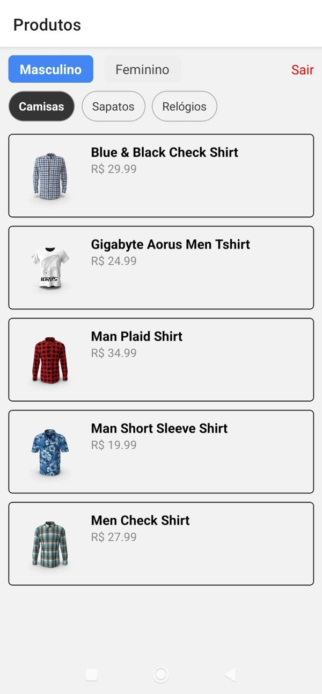
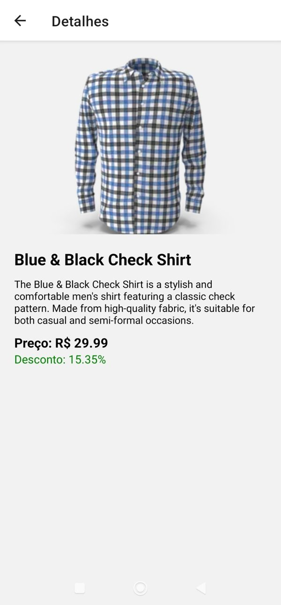

# 📱 Catálogo Mobile - Loja Online

Aplicativo mobile desenvolvido com **React Native (Expo)** para listagem de produtos de uma loja online, com navegação por categorias, login simulado, integração com API externa e tela de detalhes. Projeto criado como desafio para disciplina de Engenharia da Computação (Desenvolvimento Mobile).

---

## 🖼️ Prints da Aplicação

### Tela de Login


### Lista de Produtos


### Detalhes do Produto



---

## 🚀 Funcionalidades

- ✅ Tela de login com validação de campos e credenciais fixas
- ✅ Validação de email e senha com feedback de erro
- ✅ Botão para exibir/ocultar senha
- ✅ Navegação entre telas com React Navigation
- ✅ Consumo de API externa via Axios
- ✅ Listagem de produtos por abas (masculino/feminino)
- ✅ Tradução dos nomes de categoria para português
- ✅ Tela de detalhes com nome, imagem, descrição, preço e desconto
- ✅ Logout com confirmação por alerta

---

## 🛠️ Tecnologias Utilizadas

| Tecnologia | Descrição |
|-----------|-----------|
| [Expo](https://expo.dev) | Plataforma para desenvolvimento mobile com React Native |
| [React Native](https://reactnative.dev) | Framework para apps nativos com React |
| [Axios](https://axios-http.com) | Cliente HTTP para consumo de APIs |
| [React Navigation](https://reactnavigation.org) | Navegação entre telas |
| [Expo Vector Icons](https://icons.expo.fyi) | Ícones nativos de forma integrada |
| [DummyJSON API](https://dummyjson.com/docs/products) | API REST pública de produtos |

---

## 📁 Estrutura de Pastas

📦 catalogo-mobile/
├── App.js
├── app.json
├── babel.config.js
├── package.json
├── .gitignore
├── assets/
│   └── imagens
│   └── fonts
├── screenshots/
│   ├── login.png
│   ├── produtos.png
│   └── detalhes.png
├── src/
│   ├── components/
│   │   └── ProductCard.js
│   ├── navigation/
│   │   └── AppNavigator.js
│   ├── screens/
│   │   ├── LoginScreen.js
│   │   ├── ProductListScreen.js
│   │   └── ProductDetailsScreen.js
│   ├── services/
│   │   └── api.js
│   └── utils/
│       └── categories.js


## ▶️ Como Executar o Projeto

### 1. Clone o repositório

```bash
git clone https://github.com/seu-usuario/catalogo-mobile.git
cd catalogo-mobile

2. Instale as dependências

npm install

3. Instale o Expo CLI (caso ainda não tenha)

npm install -g expo-cli

4. Execute o app

npx expo start

Use o QR Code no navegador ou aplicativo Expo Go no celular.

---
## 🧪 Dados de Acesso para Testes

Email: usuario@teste.com
Senha: 123456

Somente com estas credenciais é possível acessar o app.

---

🔄 API Utilizada
DummyJSON API

Lista por categoria:
https://dummyjson.com/products/category/{categoria}

Detalhe por ID:
https://dummyjson.com/products/{id}

👨‍💻 Autor
Desenvolvido por Alan Demarcos — Projeto para Faculdade de Engenharia da Computação - UNIFATEC.


📄 Licença
Este projeto está licenciado sob a Licença MIT. Consulte o arquivo LICENSE para mais detalhes.


